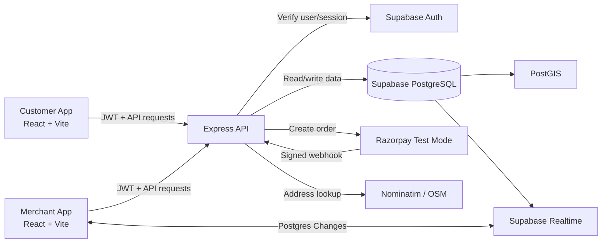

<!--
Generated for: LoyMint
Source inputs: uploaded complete technical specification DOCX + customer app screen board image
Format: Markdown, developer-ready, code/architecture friendly
-->
# LOYMINT — TECH STACK AND ENGINEERING ARCHITECTURE

```yaml
project: LoyMint
architecture: React SPA + Node/Express API + Supabase PostgreSQL/PostGIS/Realtime + Razorpay test payments
frontend_runtime: Browser-based mobile-first web app
backend_runtime: Node.js 20
execution_style: Free-tier friendly, demo-ready, production-minded MVP
```

---

## 1. Final Tech Stack

| Layer | Technology | Purpose | Reason |
|---|---|---|---|
| Frontend | React 18 + Vite | Customer and merchant SPA | Fast dev server, clean build, good for lab/demo |
| Styling | Tailwind CSS | Mobile-first UI system | Consistent spacing, responsive layouts, fast iteration |
| Routing | React Router | Separate route trees | Customer and merchant apps stay cleanly separated |
| Forms | React Hook Form + Zod | Forms and validation | Safer validation with less boilerplate |
| State | Zustand + React Context | Auth/session/UI state | Lightweight and readable for MVP |
| Data Fetching | TanStack Query | API caching and retries | Better loading/error/retry states |
| QR Scanner | html5-qrcode | Camera QR scan | Browser-supported QR scanner |
| QR Generator | qrcode Node package | Merchant bill QR image | Simple server-side QR generation |
| Backend | Node.js 20 + Express | Secure API gateway | Handles QR/payment/points logic server-side |
| Database | Supabase PostgreSQL 15 | Relational persistence | Auth-friendly, realtime, SQL-first |
| Geo Queries | PostGIS | Nearby shop distance | Accurate radius and distance queries |
| Auth | Supabase Auth | Email/phone/Google login | Free-tier authentication |
| Realtime | Supabase Realtime | Merchant payment updates | Postgres change subscriptions |
| Payments | Razorpay Test Mode | UPI payment simulation | Good for demo; webhook-based verification |
| Geocoding | Nominatim / OpenStreetMap | Address to lat/lng | Free, no API key, 1 req/sec limit |
| Frontend Hosting | Vercel | HTTPS static deployment | Simple React deployment |
| Backend Hosting | Render | Node API deployment | Free-tier web service suitable for demo |
| Version Control | GitHub | Source control | Deployment integration and collaboration |

---

## 2. High-Level Architecture



---

## 3. Recommended Repository Structure

```txt
loymint/
  README.md
  package.json
  .env.example

  apps/
    web/
      package.json
      index.html
      src/
        main.jsx
        app/
          App.jsx
          router.jsx
          providers.jsx
        routes/
          customer/
            LoginPage.jsx
            DashboardPage.jsx
            NearbyShopsPage.jsx
            ShopDetailPage.jsx
            ScannerPage.jsx
            PaymentPreviewPage.jsx
            RewardsPage.jsx
            ProfilePage.jsx
          merchant/
            MerchantLoginPage.jsx
            MerchantDashboardPage.jsx
            ShopSetupPage.jsx
            GenerateQrPage.jsx
            OffersManagerPage.jsx
        components/
          ui/
            Button.jsx
            Card.jsx
            Input.jsx
            Modal.jsx
            BottomNav.jsx
            FloatingScanButton.jsx
            StatusBadge.jsx
            EmptyState.jsx
          loyalty/
            PointsCard.jsx
            OfferCard.jsx
            ShopCard.jsx
            TransactionRow.jsx
            PaymentBreakdown.jsx
          merchant/
            QrDisplay.jsx
            CountdownTimer.jsx
            PaymentStatusPanel.jsx
        hooks/
          useAuth.js
          useGeolocation.js
          useRealtimeTransaction.js
          useScanner.js
        services/
          apiClient.js
          supabaseClient.js
          queryKeys.js
        stores/
          authStore.js
          uiStore.js
        utils/
          currency.js
          dates.js
          validators.js
        styles/
          index.css

    api/
      package.json
      src/
        server.js
        app.js
        config/
          env.js
          supabase.js
          razorpay.js
        middleware/
          requireAuth.js
          requireRole.js
          errorHandler.js
          rateLimit.js
        modules/
          auth/
            auth.routes.js
            auth.service.js
          users/
            users.routes.js
            users.service.js
          shops/
            shops.routes.js
            shops.service.js
          qr/
            qr.routes.js
            qr.service.js
          payments/
            payments.routes.js
            payments.service.js
            razorpayWebhook.js
          rewards/
            rewards.routes.js
            rewards.service.js
          offers/
            offers.routes.js
            offers.service.js
          merchant/
            merchant.routes.js
            merchant.service.js
        db/
          migrations/
          seed.sql
        utils/
          AppError.js
          asyncHandler.js
          idempotency.js
          logger.js
```

---

## 4. Environment Variables

### Frontend `.env`

```env
VITE_APP_NAME=LoyMint
VITE_API_BASE_URL=https://your-render-api.onrender.com
VITE_SUPABASE_URL=https://your-project.supabase.co
VITE_SUPABASE_ANON_KEY=your_public_anon_key
VITE_RAZORPAY_KEY_ID=rzp_test_public_key
```

### Backend `.env`

```env
NODE_ENV=development
PORT=8080

SUPABASE_URL=https://your-project.supabase.co
SUPABASE_ANON_KEY=your_public_anon_key
SUPABASE_SERVICE_ROLE_KEY=server_only_service_role_key

QR_SECRET=replace_with_long_random_secret
JWT_AUDIENCE=authenticated

RAZORPAY_KEY_ID=rzp_test_key_id
RAZORPAY_KEY_SECRET=rzp_test_key_secret
RAZORPAY_WEBHOOK_SECRET=replace_with_webhook_secret

CLIENT_ORIGIN=http://localhost:5173
NOMINATIM_USER_AGENT=LoyMintDemo/1.0 contact@example.com
```

---

## 5. Database Schema

### 5.1 Enable PostGIS

```sql
CREATE EXTENSION IF NOT EXISTS postgis;
CREATE EXTENSION IF NOT EXISTS pgcrypto;
```

### 5.2 Enums / Checks

```sql
CREATE TYPE user_role AS ENUM ('customer', 'shopkeeper');
CREATE TYPE transaction_status AS ENUM ('pending', 'success', 'failed', 'reward_paid', 'partial_paid', 'expired');
CREATE TYPE points_reason AS ENUM ('purchase', 'reward_redeem', 'referral_bonus', 'manual_adjustment');
CREATE TYPE reward_type AS ENUM ('free_item', 'discount_coupon');
```

### 5.3 Users

```sql
CREATE TABLE public.users (
  id UUID PRIMARY KEY DEFAULT gen_random_uuid(),
  auth_user_id UUID UNIQUE NOT NULL,
  role user_role NOT NULL DEFAULT 'customer',
  name VARCHAR(100) NOT NULL,
  email VARCHAR(255) UNIQUE,
  phone VARCHAR(20) UNIQUE,
  profile_pic TEXT,
  points_balance INTEGER NOT NULL DEFAULT 0 CHECK (points_balance >= 0),
  referral_code VARCHAR(10) UNIQUE NOT NULL,
  referred_by UUID REFERENCES public.users(id) ON DELETE SET NULL,
  preferences TEXT[] NOT NULL DEFAULT '{}',
  created_at TIMESTAMPTZ NOT NULL DEFAULT now(),
  updated_at TIMESTAMPTZ NOT NULL DEFAULT now()
);
```

### 5.4 Shops

```sql
CREATE TABLE public.shops (
  id UUID PRIMARY KEY DEFAULT gen_random_uuid(),
  name VARCHAR(100) NOT NULL,
  category VARCHAR(50),
  address TEXT NOT NULL,
  location GEOGRAPHY(POINT, 4326) NOT NULL,
  earn_points_per_100 INTEGER NOT NULL CHECK (earn_points_per_100 >= 0),
  redeem_points_per_rupee INTEGER NOT NULL CHECK (redeem_points_per_rupee > 0),
  rating DECIMAL(2,1) NOT NULL DEFAULT 0 CHECK (rating >= 0 AND rating <= 5),
  owner_id UUID NOT NULL REFERENCES public.users(id) ON DELETE CASCADE,
  is_active BOOLEAN NOT NULL DEFAULT true,
  created_at TIMESTAMPTZ NOT NULL DEFAULT now()
);

CREATE INDEX shops_location_gix ON public.shops USING GIST (location);
CREATE INDEX shops_owner_idx ON public.shops(owner_id);
```

### 5.5 Transactions

```sql
CREATE TABLE public.transactions (
  id UUID PRIMARY KEY DEFAULT gen_random_uuid(),
  order_id VARCHAR(60) UNIQUE NOT NULL,
  user_id UUID REFERENCES public.users(id) ON DELETE SET NULL,
  shop_id UUID NOT NULL REFERENCES public.shops(id) ON DELETE CASCADE,
  amount INTEGER NOT NULL CHECK (amount > 0),
  reward_points_used INTEGER NOT NULL DEFAULT 0 CHECK (reward_points_used >= 0),
  reward_value_used INTEGER NOT NULL DEFAULT 0 CHECK (reward_value_used >= 0),
  upi_paid INTEGER NOT NULL DEFAULT 0 CHECK (upi_paid >= 0),
  status transaction_status NOT NULL DEFAULT 'pending',
  razorpay_order_id VARCHAR(100),
  razorpay_payment_id VARCHAR(100),
  expires_at TIMESTAMPTZ NOT NULL,
  created_at TIMESTAMPTZ NOT NULL DEFAULT now(),
  updated_at TIMESTAMPTZ NOT NULL DEFAULT now()
);

CREATE INDEX transactions_user_idx ON public.transactions(user_id);
CREATE INDEX transactions_shop_idx ON public.transactions(shop_id);
CREATE INDEX transactions_status_idx ON public.transactions(status);
CREATE INDEX transactions_expires_idx ON public.transactions(expires_at);
```

### 5.6 Points Log

```sql
CREATE TABLE public.points_log (
  id UUID PRIMARY KEY DEFAULT gen_random_uuid(),
  user_id UUID NOT NULL REFERENCES public.users(id) ON DELETE CASCADE,
  transaction_id UUID REFERENCES public.transactions(id) ON DELETE SET NULL,
  points_change INTEGER NOT NULL,
  reason points_reason NOT NULL,
  created_at TIMESTAMPTZ NOT NULL DEFAULT now()
);

CREATE INDEX points_log_user_idx ON public.points_log(user_id);
CREATE INDEX points_log_transaction_idx ON public.points_log(transaction_id);
```

### 5.7 Offers, Favourites, Saved Offers, Addresses

```sql
CREATE TABLE public.offers (
  id UUID PRIMARY KEY DEFAULT gen_random_uuid(),
  shop_id UUID NOT NULL REFERENCES public.shops(id) ON DELETE CASCADE,
  title VARCHAR(100) NOT NULL,
  description TEXT,
  points_required INTEGER NOT NULL CHECK (points_required > 0),
  reward_type reward_type NOT NULL,
  reward_value VARCHAR(100),
  valid_until TIMESTAMPTZ,
  is_active BOOLEAN NOT NULL DEFAULT true,
  created_at TIMESTAMPTZ NOT NULL DEFAULT now()
);

CREATE TABLE public.favorite_shops (
  user_id UUID NOT NULL REFERENCES public.users(id) ON DELETE CASCADE,
  shop_id UUID NOT NULL REFERENCES public.shops(id) ON DELETE CASCADE,
  created_at TIMESTAMPTZ NOT NULL DEFAULT now(),
  PRIMARY KEY (user_id, shop_id)
);

CREATE TABLE public.saved_offers (
  id UUID PRIMARY KEY DEFAULT gen_random_uuid(),
  user_id UUID NOT NULL REFERENCES public.users(id) ON DELETE CASCADE,
  offer_id UUID NOT NULL REFERENCES public.offers(id) ON DELETE CASCADE,
  saved_at TIMESTAMPTZ NOT NULL DEFAULT now(),
  UNIQUE (user_id, offer_id)
);

CREATE TABLE public.addresses (
  id UUID PRIMARY KEY DEFAULT gen_random_uuid(),
  user_id UUID NOT NULL REFERENCES public.users(id) ON DELETE CASCADE,
  address_line TEXT NOT NULL,
  city VARCHAR(50) NOT NULL,
  district VARCHAR(50) NOT NULL,
  state VARCHAR(50) NOT NULL,
  is_default BOOLEAN NOT NULL DEFAULT false
);
```

---

## 6. API Contract

### 6.1 Auth / Profile

```yaml
GET /api/me:
  auth: required
  returns: current user profile

POST /api/profile/complete:
  auth: required
  body:
    name: string
    role: customer | shopkeeper
    referralCode: optional string
  returns: user profile
```

### 6.2 Shops

```yaml
GET /api/shops/nearby:
  auth: required
  query:
    lat: number
    lng: number
    radius: number default 5
    category: optional string
  returns: shops sorted by distance

GET /api/shops/:shopId:
  auth: required
  returns: shop detail with active offers

POST /api/merchant/shop:
  auth: shopkeeper
  body:
    name: string
    address: string
    category: string
    earnPointsPer100: integer
    redeemPointsPerRupee: integer
  returns: shop profile
```

### 6.3 QR and Payment

```yaml
POST /api/merchant/bills/generate-qr:
  auth: shopkeeper
  body:
    amount: integer
  returns:
    orderId: string
    qrDataUrl: string
    expiresAt: iso_datetime

POST /api/payment/initiate-from-qr:
  auth: customer
  body:
    qrToken: string
  returns:
    valid: boolean
    orderId: string
    amount: integer
    shopName: string
    earnRate: integer
    redeemRate: integer

POST /api/payment/reward-preview:
  auth: customer
  body:
    orderId: string
    applyRewards: boolean
  returns:
    rewardDiscount: integer
    pointsToRedeem: integer
    remainingUpi: integer

POST /api/payment/create-order:
  auth: customer
  body:
    orderId: string
    rewardPointsToRedeem: integer
  returns:
    razorpayOrderId: string
    amount: integer

POST /api/payment/reward-only:
  auth: customer
  body:
    orderId: string
    pointsToRedeem: integer
  returns:
    status: reward_paid

POST /api/webhook/razorpay:
  auth: webhook_signature
  body: raw_razorpay_event
  returns: ok
```

---

## 7. Nearby Shops SQL

```sql
SELECT
  s.id,
  s.name,
  s.category,
  s.address,
  s.earn_points_per_100,
  s.redeem_points_per_rupee,
  s.rating,
  ST_Distance(
    s.location,
    ST_SetSRID(ST_MakePoint(:lng, :lat), 4326)::geography
  ) / 1000 AS distance_km
FROM public.shops s
WHERE
  s.is_active = true
  AND ST_DWithin(
    s.location,
    ST_SetSRID(ST_MakePoint(:lng, :lat), 4326)::geography,
    :radius_km * 1000
  )
ORDER BY distance_km ASC;
```

---

## 8. Reward Calculation Service Contract

```ts
type RewardPreviewInput = {
  userPoints: number;
  billAmount: number;
  redeemPointsPerRupee: number;
};

type RewardPreviewOutput = {
  rewardDiscount: number;
  pointsToRedeem: number;
  remainingUpi: number;
  paymentMode: 'normal_upi' | 'full_reward' | 'partial_reward_upi';
};

export function calculateRewardPreview(input: RewardPreviewInput): RewardPreviewOutput {
  const maxDiscount = Math.floor(input.userPoints / input.redeemPointsPerRupee);
  const rewardDiscount = Math.min(maxDiscount, input.billAmount);
  const pointsToRedeem = rewardDiscount * input.redeemPointsPerRupee;
  const remainingUpi = input.billAmount - rewardDiscount;

  return {
    rewardDiscount,
    pointsToRedeem,
    remainingUpi,
    paymentMode: rewardDiscount === 0
      ? 'normal_upi'
      : remainingUpi === 0
        ? 'full_reward'
        : 'partial_reward_upi',
  };
}
```

---

## 9. Realtime Subscription Contract

```ts
const subscription = supabase
  .channel(`merchant-shop-${shopId}`)
  .on(
    'postgres_changes',
    {
      event: 'UPDATE',
      schema: 'public',
      table: 'transactions',
      filter: `shop_id=eq.${shopId}`,
    },
    (payload) => {
      const status = payload.new.status;
      if (['success', 'partial_paid', 'reward_paid', 'failed', 'expired'].includes(status)) {
        updatePaymentStatus(payload.new);
      }
    }
  )
  .subscribe();
```

---

## 10. Deployment Architecture

```yaml
deployment:
  frontend:
    provider: Vercel
    build_command: npm run build
    output: apps/web/dist
    required_env:
      - VITE_API_BASE_URL
      - VITE_SUPABASE_URL
      - VITE_SUPABASE_ANON_KEY
      - VITE_RAZORPAY_KEY_ID
  backend:
    provider: Render
    runtime: Node 20
    start_command: npm run start -w apps/api
    required_env:
      - SUPABASE_URL
      - SUPABASE_ANON_KEY
      - SUPABASE_SERVICE_ROLE_KEY
      - QR_SECRET
      - RAZORPAY_KEY_ID
      - RAZORPAY_KEY_SECRET
      - RAZORPAY_WEBHOOK_SECRET
      - CLIENT_ORIGIN
  database:
    provider: Supabase
    requirements:
      - PostgreSQL
      - PostGIS enabled
      - RLS enabled
      - Realtime enabled for transactions table
```

---

## 11. Engineering Quality Gates

```yaml
quality_gates:
  code:
    - ESLint passes.
    - No secrets committed.
    - All route-level auth checks implemented.
  database:
    - RLS enabled on every table.
    - Negative points blocked by CHECK and transaction logic.
    - Unique order_id enforced.
  payment:
    - Webhook signature verification tested.
    - Duplicate webhook does not duplicate points.
    - Client-side success ignored until server confirms.
  qr:
    - QR JWT expires after 120 seconds.
    - Invalid token rejected.
    - Completed transaction cannot be paid again.
  ui:
    - Works on 390px mobile width.
    - Scan button accessible from bottom nav.
    - All loading, empty, success, failed, and expired states visible.
```
