<!--
Generated for: LoyMint
Source inputs: uploaded complete technical specification DOCX + customer app screen board image
Format: Markdown, workflow + Mermaid + YAML
-->
# LOYMINT — USER WORKFLOWS

```yaml
project: LoyMint
workflow_scope:
  - customer onboarding
  - merchant onboarding
  - merchant QR bill generation
  - customer QR scan and payment selection
  - normal UPI payment
  - full reward payment
  - partial reward plus UPI payment
  - realtime merchant confirmation
  - nearby shops
  - rewards, favourites, saved offers, referrals
```

---

## 1. Complete System Flow

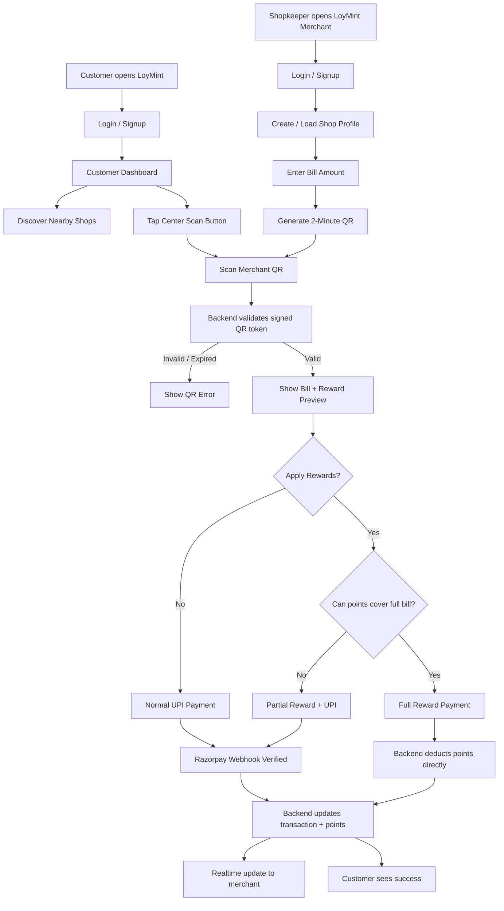

---

## 2. Customer Registration / Login Workflow

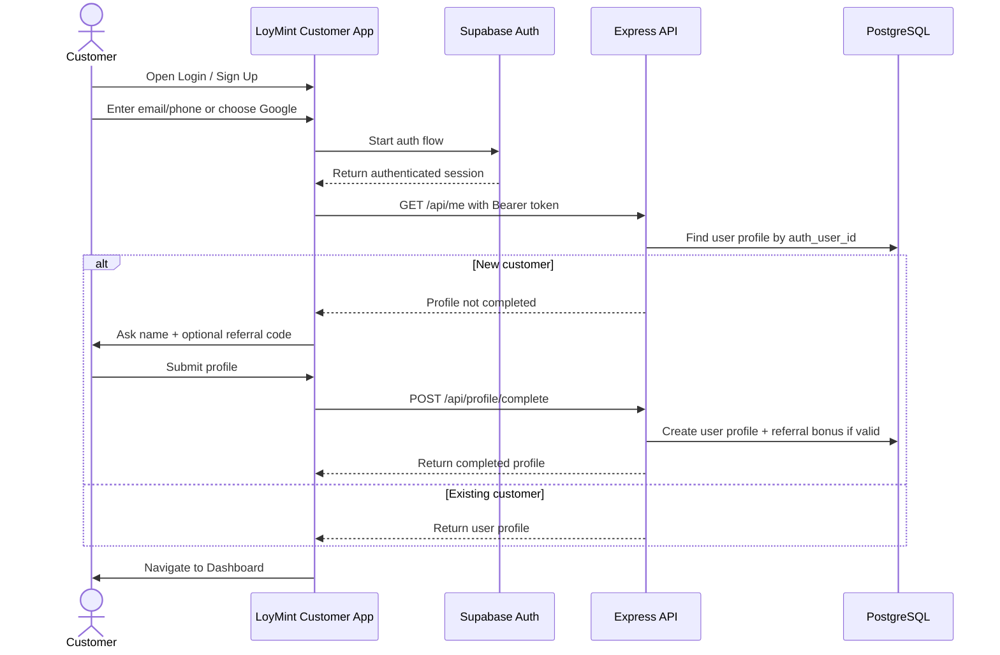

```yaml
customer_login_acceptance:
  - Customer can sign up/login using email, phone, or Google.
  - New customer must provide name before dashboard access.
  - Referral code is optional.
  - Invalid referral code does not block account creation but shows a warning.
  - Session expiry redirects customer to login.
```

---

## 3. Merchant Registration / Shop Setup Workflow

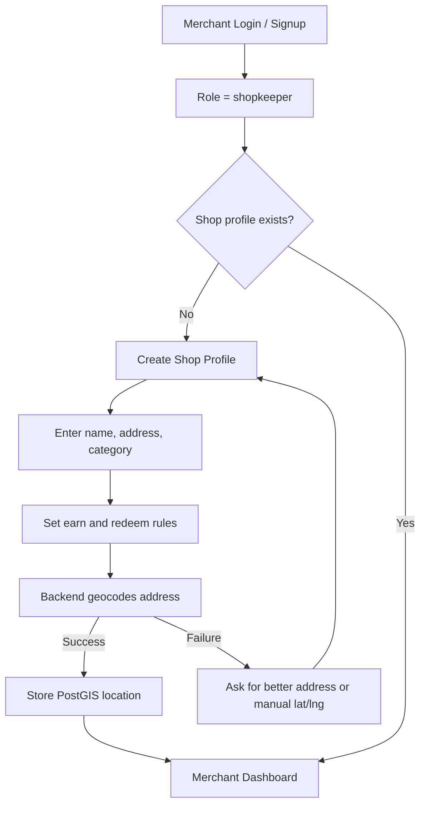

```yaml
shop_setup_rules:
  shop_name:
    required: true
    max_length: 100
  address:
    required: true
    geocoding: Nominatim
    fallback: manual latitude and longitude
  earn_points_per_100:
    required: true
    min: 0
  redeem_points_per_rupee:
    required: true
    min: 1
  owner:
    must_equal: authenticated shopkeeper user
```

---

## 4. Merchant Generate Bill + QR Workflow

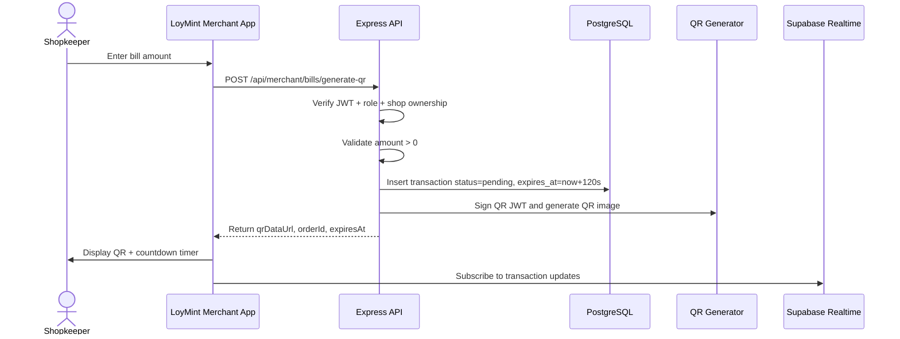

```yaml
qr_screen_states:
  idle:
    description: No active QR.
  generating:
    description: Merchant clicked generate and API request is running.
  waiting_for_payment:
    description: QR visible, countdown running, transaction status pending.
  payment_received:
    description: Status success, reward_paid, or partial_paid.
  expired:
    description: Countdown ended or backend marks transaction expired.
  failed:
    description: Razorpay payment failed or API error occurred.
```

---

## 5. Customer Scan QR Workflow

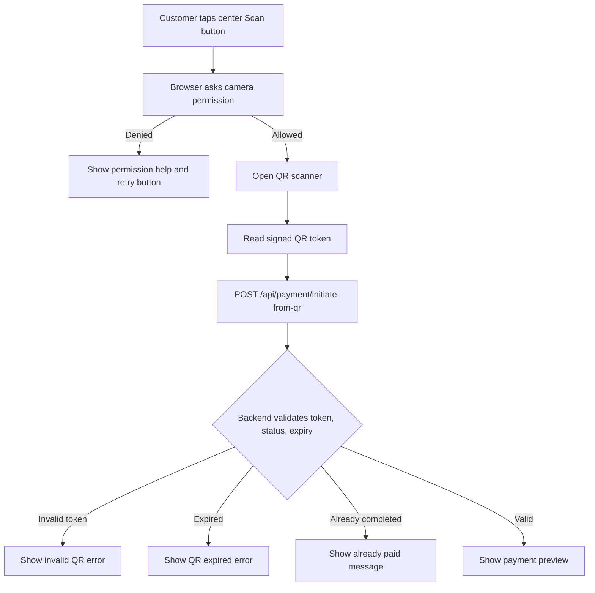

```yaml
scan_result_contract:
  valid_qr_response:
    orderId: string
    shopId: uuid
    shopName: string
    amount: integer
    earnRate: integer
    redeemRate: integer
    expiresAt: iso_datetime
  invalid_qr_errors:
    - QR_INVALID
    - QR_EXPIRED
    - TRANSACTION_NOT_FOUND
    - TRANSACTION_ALREADY_COMPLETED
    - TRANSACTION_NOT_PENDING
```

---

## 6. Reward Preview Workflow

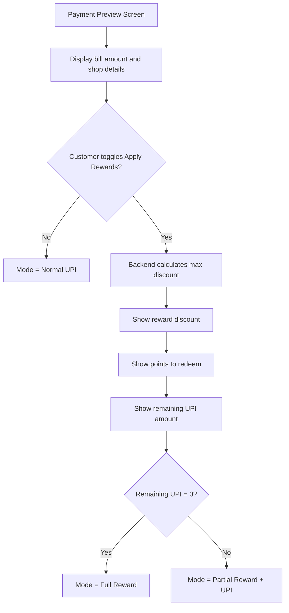

```yaml
payment_preview_required_fields:
  - shop_name
  - bill_amount
  - available_points
  - earn_points_per_100
  - redeem_points_per_rupee
  - reward_discount_rupees
  - points_to_redeem
  - remaining_upi_amount
  - selected_payment_mode
critical_rule: UI may display calculations, but backend must be the source of truth.
```

---

## 7. Payment Case A — Normal UPI Payment

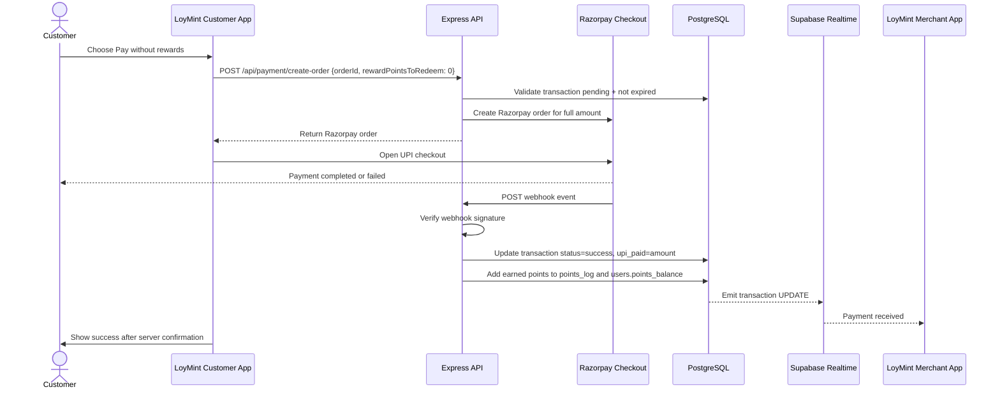

```yaml
normal_upi_rules:
  reward_points_used: 0
  reward_value_used: 0
  upi_paid: full_bill_amount
  point_earning_basis: upi_paid
  final_status: success
```

---

## 8. Payment Case B — Full Reward Payment

```mermaid
sequenceDiagram
    actor Customer
    participant UI as LoyMint Customer App
    participant API as Express API
    participant DB as PostgreSQL
    participant RT as Supabase Realtime
    participant MerchantUI as LoyMint Merchant App

    Customer->>UI: Apply rewards; remaining UPI = 0
    UI->>API: POST /api/payment/reward-only
    API->>DB: Start DB transaction
    API->>DB: Lock user row and transaction row
    API->>DB: Validate points balance and pending status
    API->>DB: Deduct points from user balance
    API->>DB: Insert negative points_log record
    API->>DB: Update transaction status=reward_paid
    API->>DB: Commit
    DB-->>RT: Emit transaction UPDATE
    RT-->>MerchantUI: Payment received via rewards
    API-->>UI: Return success
    UI->>Customer: Show reward payment success
```

```yaml
full_reward_rules:
  upi_paid: 0
  razorpay_required: false
  points_deducted: points_to_redeem
  points_earned: 0
  final_status: reward_paid
```

---

## 9. Payment Case C — Partial Reward + UPI

```mermaid
sequenceDiagram
    actor Customer
    participant UI as LoyMint Customer App
    participant API as Express API
    participant RZP as Razorpay
    participant DB as PostgreSQL
    participant RT as Supabase Realtime
    participant MerchantUI as LoyMint Merchant App

    Customer->>UI: Apply rewards; remaining UPI > 0
    UI->>API: POST /api/payment/create-order {orderId, rewardPointsToRedeem}
    API->>DB: Validate pending status, expiry, points balance
    API->>DB: Store reward_points_used and reward_value_used as reserved values
    API->>RZP: Create order for remaining UPI amount
    API-->>UI: Return Razorpay order
    UI->>RZP: Customer pays remaining amount
    RZP->>API: Send webhook
    API->>API: Verify webhook signature
    API->>DB: Start DB transaction
    API->>DB: Deduct reserved reward points
    API->>DB: Add earned points based on UPI paid
    API->>DB: Update transaction status=partial_paid
    API->>DB: Commit
    DB-->>RT: Emit transaction UPDATE
    RT-->>MerchantUI: Payment received with reward discount
    UI->>Customer: Show success after server confirmation
```

```yaml
partial_reward_rules:
  reward_points_used: points_to_redeem
  reward_value_used: reward_discount_rupees
  upi_paid: bill_amount - reward_discount_rupees
  points_earned_formula: floor(upi_paid / 100) * earn_points_per_100
  final_status: partial_paid
```

---

## 10. Merchant Realtime Confirmation Workflow

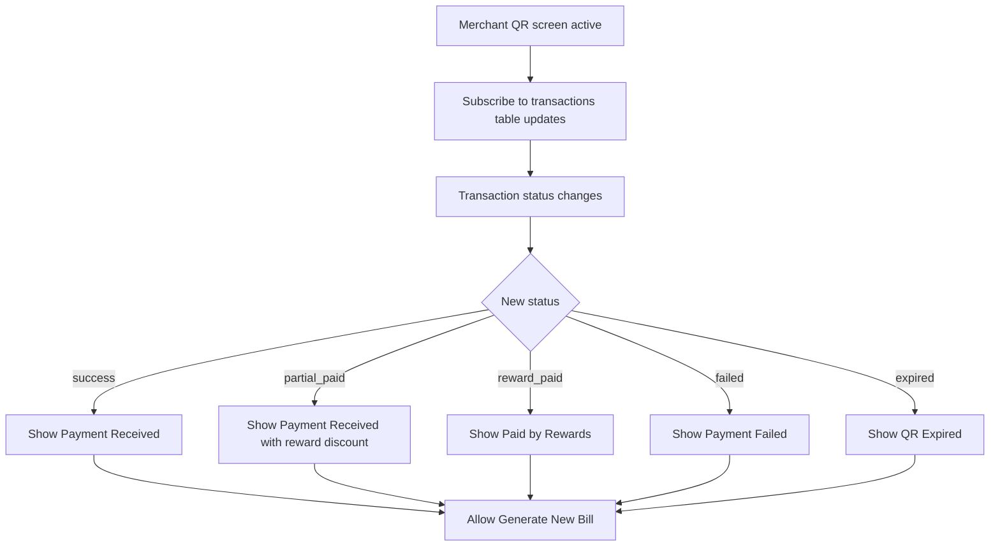

```yaml
merchant_confirmation_ui:
  waiting:
    message: Waiting for payment
    icon: loading
  success:
    message: Payment received
    fields:
      - total_amount
      - reward_discount
      - upi_paid
      - transaction_id
  failed:
    message: Payment failed. Generate a new QR if needed.
  expired:
    message: QR expired. Generate a new QR.
```

---

## 11. Nearby Shops Workflow

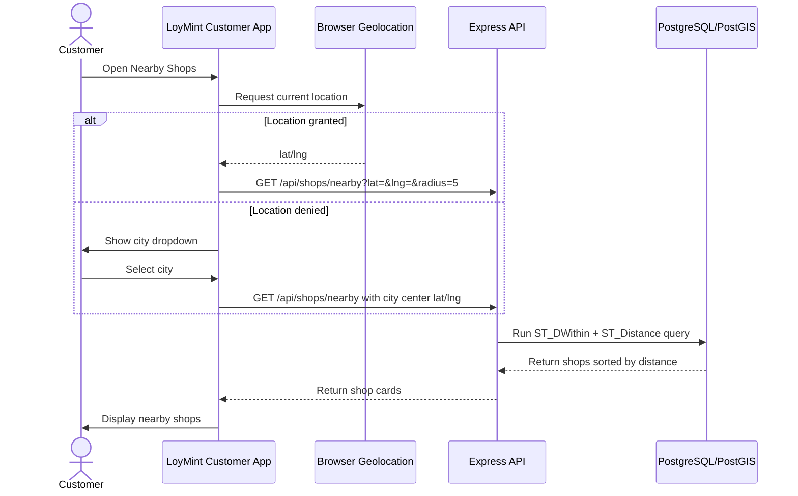

```yaml
shop_card:
  required_fields:
    - shop_name
    - category
    - rating
    - distance_km
    - earn_rate
    - image_or_placeholder
    - favorite_button
  sorting: nearest_first
  filters:
    - category
    - search_text
```

---

## 12. Rewards and Offers Workflow

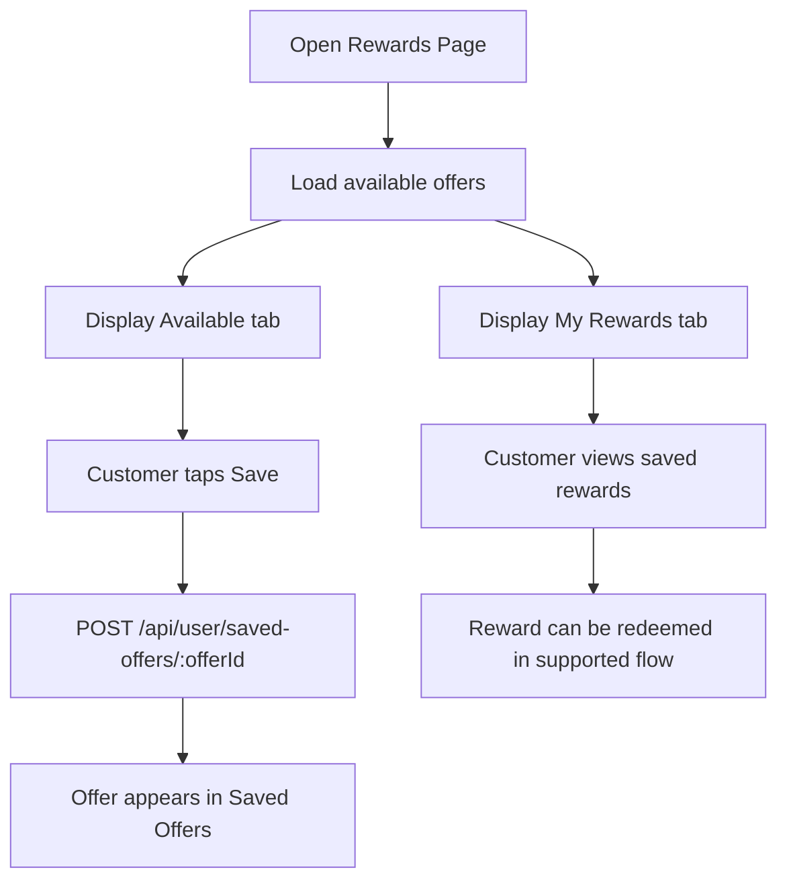

```yaml
offer_card:
  required_fields:
    - title
    - description
    - points_required
    - reward_type
    - shop_name
    - valid_until
    - save_button
```

---

## 13. Favourite Shops Workflow

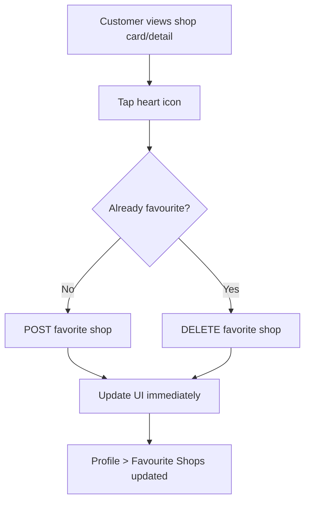

```yaml
favorite_rules:
  uniqueness: one favorite_shops row per user_id + shop_id
  auth: customer only
  ui_behavior: optimistic update with rollback on API failure
```

---

## 14. Referral Workflow

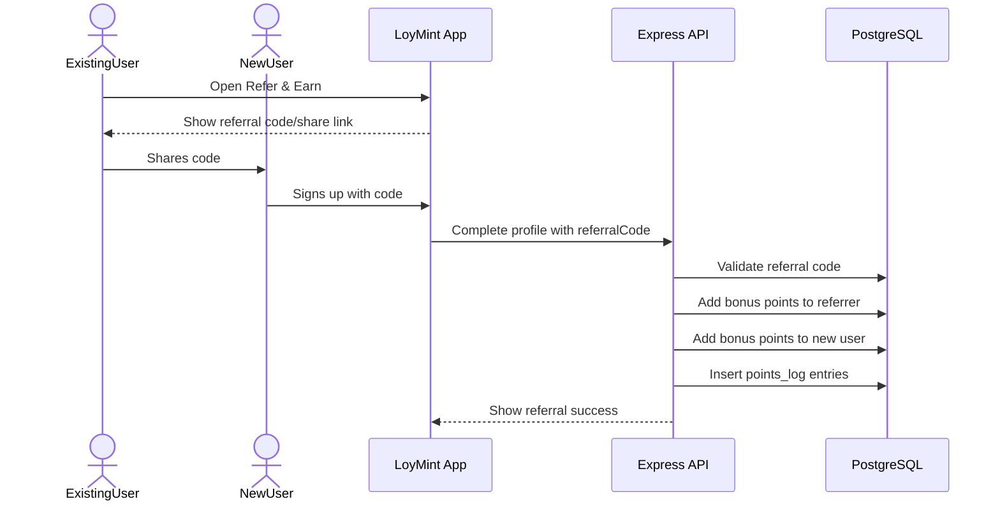

```yaml
referral_rules:
  referral_code_generation: first_5_letters_of_name_plus_random_digits
  referral_bonus_points: 50
  self_referral: forbidden
  duplicate_referral_for_same_user: forbidden
  ledger_required: true
```

---

## 15. Profile Workflow

```yaml
profile_menu:
  header:
    - profile_photo
    - name
    - email
    - phone
    - points_balance
  menu_items:
    - My Transactions
    - My Rewards
    - Favourite Shops
    - Saved Offers
    - Refer & Earn
    - Help & Support
    - Logout
```

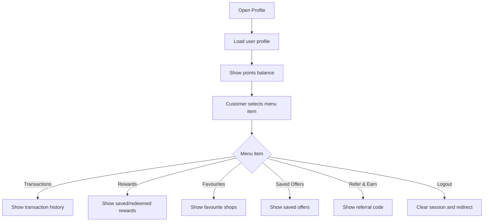

---

## 16. Edge Case Workflow Matrix

```yaml
edge_cases:
  qr_expired:
    backend_status: QR_EXPIRED
    frontend_action: show expired message and ask for new QR
  duplicate_payment_attempt:
    backend_status: TRANSACTION_ALREADY_COMPLETED
    frontend_action: block payment and show completed message
  insufficient_points:
    backend_action: calculate maximum possible discount
    frontend_action: offer partial reward + UPI
  razorpay_failed:
    backend_action: status failed, no points mutation
    frontend_action: show failure and retry guidance
  realtime_lost:
    frontend_action: show reconnecting and resubscribe
  geolocation_denied:
    frontend_action: show city fallback
  geocoding_failed:
    merchant_action: ask for specific address or manual lat/lng
  webhook_duplicate:
    backend_action: idempotent no-op if already processed
  negative_points_risk:
    backend_action: lock user row, re-check balance, rollback on failure
```
